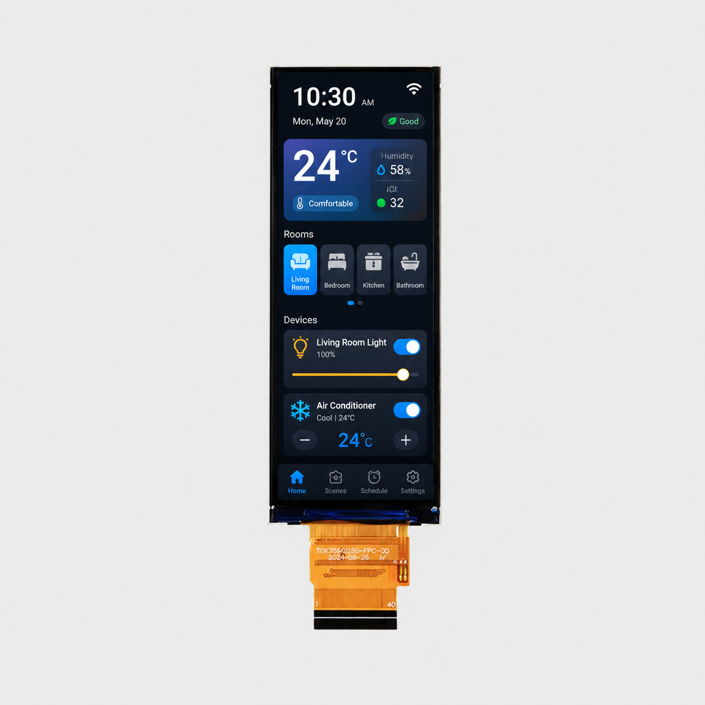

<h1 align="center">OSPTEK 3.99″ TFT 400×960 (ST7701 · SPI / RGB)</h1>

<b>Bar TFT module · SPI / RGB · ST7701 · Multi-version index</b>

English | <a href="./README.md">简体中文</a>

  
  
  
  

## Contents

- [About](#about)
- [Versions](#versions)
- [YDP399B002-V4](#ydp399b002-v4)
- [Where to Buy](#where-to-buy)
- [Support](#support)

---

## About

This repository holds materials for the **3.99″ 400×960 TFT (SPI / RGB · ST7701)** module family.

The **root README is the navigation page**. Use the table below for a quick scan; open **Full docs** to enter that **part-number folder** under `versions/` (product page, datasheets, and examples live there).

Repo id: `tft-3.99-400x960-spi_rgb-st7701`

---

## Versions

| Version | Image | Summary | Full docs |
| ------- | ----- | ------- | --------- |
| YDP399B002-V4 |  | [Summary](#ydp399b002-v4) | [Full docs](./versions/YDP399B002-V4/) |

---

## YDP399B002-V4

**Notes:** 40-pin FPC, no touch. The same FPC supports 3-line SPI or 18-bit RGB.

Full product page and datasheet: [versions/YDP399B002-V4/](./versions/YDP399B002-V4/)

---

## Where to Buy

  
  &nbsp;&nbsp;
  

**Overseas (AliExpress)**

- Store: [OSPTEK Official Store](https://www.aliexpress.com/store/1105701619)

**China (Taobao)**

- Store: [鱼鹰光电工厂店](https://shop110742373.taobao.com/)

---

## Support

- Technical support / product inquiry: <luyu@osptek.com>
- QQ group: **985881096**
- Website: <https://osptek.com/>
- Feel free to open an Issue in this repository with any questions

---

© 2026 OSPTEK · Materials in this repository are licensed under CC BY 4.0

